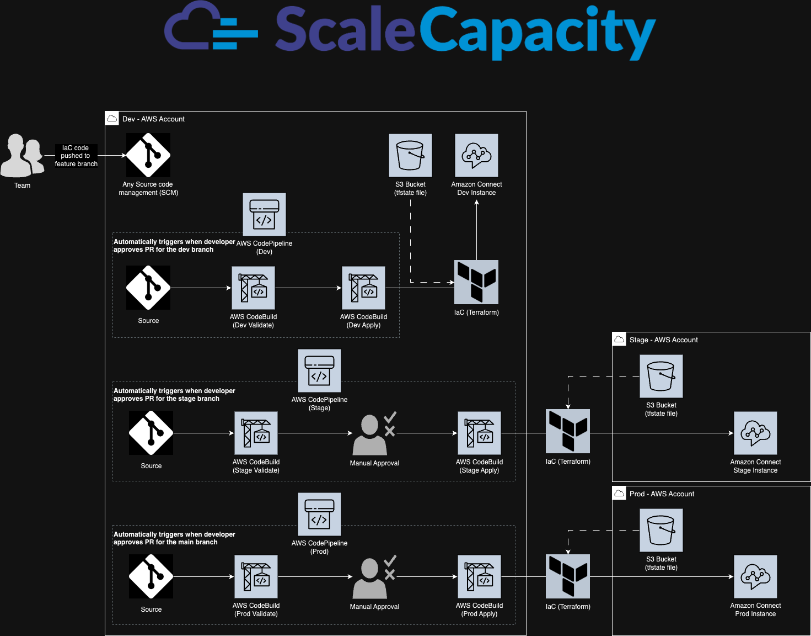

# Connect DevOps Pipeline

Terraform code for the AWS Connect along with the DevOps Pipeline.

Content:

- DevOps Pipeline Workflow
- Steps to deploy complete infrastructure
- Terraform code understanding

### DevOps Pipeline Workflow

This is DevOps Pipeline architecture for deploying the AWS Connect resources based on different environment and needs.

- Team will push the code to repo (Any SCM). In repository, There will be 3 Branch (main, stage & dev).
  - **main** branch will be responsible for the Prod deployment.
  - **stage** branch will be responsible for the Stage deployment.
  - **dev** branch will be responsible for the Dev deployment.
- For deploying the resources, we would have 3 pipeline in the Dev AWS Account.
  - **Pipeline 1: Dev**
    - When developer push the code in the _dev_ branch, pipeline will automatically trigger this pipeline and deploy the resources in Dev AWS account itself via Terraform.
  - **Pipeline 2: Stage**
    - When developer finalize the feature code and merge the code in _stage_ branch, Pipeline will trigger and first it would validate the resources.
    - Based on validation, Team needs to manually approve the stage on CodePipeline and then it would start deploying resources of staging environment in Stage AWS account with help of IAM assume role.
  - **Pipeline 3: Prod**
    - When developer finalize the feature by testing it on the stagging environment, merge the code in _main_ branch. Pipeline will trigger and similar to stage, first it would validate the resources.
    - Based on validation, Team needs to manually approve the stage on CodePipeline and then it would start deploying resources of production environment in Prod AWS account with help of IAM assume role.

### Steps to deploy complete infrastructure:

**_Prerequisite:_**

- Terraform installed on your local machine
- Configure the aws-cli with dev account IAM user for deploying pipeline.
- IAM user must be having HTTPS Git credentials generated for AWS CodeCommit (if using CodeCommit as SCM)

**_Pipeline infrastructure:_**

`cd ./pipeline/infrastructure`

1. Replace the value of the S3 bucket & Region in the "./backend-tfvars/pipeline.hcl" file

   - Open "pipeline.hcl" file

   `nano ./backend-tfvars/pipeline.hcl`

   - Update the S3 bucket name & Region according to your preference

   > bucket = "{s3_bucket_name}"
   > key = "pipeline/terraform.tfstate"
   > region = "{aws_region}" // us-east-1
   > encrypt = true

   _NOTE: General purpose buckets and directory buckets in Amazon S3 must be named according to the [Bucket naming guidelines](https://docs.aws.amazon.com/AmazonS3/latest/userguide/bucketnamingrules.html)_

2. Configuring the S3 Backend for the pipeline using the shell script

   - Execute the script for the creation of the S3 bucket with versioning enabled.

   `chmod -R 755 ./backend-tfvars/s3_buckets/`
   `./backend-tfvars/s3_buckets/pipeline_s3.sh`

3. Update the "pipeline/infrastructure/tfvars/pipeline.tfvars" file for customize pipeline deployment

   - Open "pipeline.tfvars" file

   `nano ./tfvars/pipeline.tfvars`

   > NOTE: Update the value in the pipeline.tfvars file based on your preference.

   > Ex.
   > region = "{region_name}"
   > codecommit_repo_name = "{repo_name}"
   > STAGE_ASSUME_IAM_ROLE = "{assume_role_arn}"
   > dev_codebuild_source_branch = "{branch_name}"

4. initializes the terraform for the pipeline infrastructure deployment

   `terraform init --backend-config backend-tfvars/pipeline.hcl`

5. Validate the terraform code using following command

   `terraform validate`

6. Deployed the DevOps Pipeline infrastructure

   `terraform plan --var-file ./tfvars/pipeline.tfvars`
   `terraform apply --var-file tfvars/pipeline.tfvars`

**_Connect infrastructure:_**

`cd ./../../connect_setup`

1. Replace the value of the S3 bucket & Region in the "./backend-tfvars/" file.

   > NOTE: Needs to update 3 files based on your environments

   - Update the dev, stage and prod.hcl file based on your preference.

   `nano ./backend-tfvars/dev.hcl`

   dev.hcl:

   > bucket = "{s3_bucket_name}"
   > key = "{env_name}/terraform.tfstate" //dev, stage, prod
   > region = "{aws_region}" // us-east-1
   > encrypt = true

2. Update the "./tfvars/" file for customize pipeline deployment

   > NOTE: Ensure that the value in the dev, stage, and prod.tfvars files is set accordingly. This will ensure that the resources are configured according to your preferences

   > Ex.
   > identity_management_type = "CONNECT_MANAGED"
   > instance_alias = "{connect_instance_name}"
   > inbound_calls_enabled = true
   > outbound_calls_enabled = true

3. Automatically start the pipeline by pushing master code to repositories based on the branch.

   - Clone the repository at your desire location:

   `cd ./Documents`

   `git clone https://git-codecommit.{region_name}.amazonaws.com/v1/repos/{repo_name}`

   - Adding terraform code in the repository:

   `cd {repo_name}`

   `git checkout -b {branch_name}`

   `cp -r {location of the master template}/* ./`

   `git add .`

   `git commit -m "Inital commit"`

   - Push the code to repository:

   `git push -u origin {branch_name}`

> > **NOTE: For further chances refer the cloned repo and release the changes as needed.**

---

### Terraform code understanding

**Terminologies:**

- 𝐂𝐨𝐧𝐟𝐢𝐠𝐮𝐫𝐚𝐭𝐢𝐨𝐧 𝐅𝐢𝐥𝐞𝐬 (.𝐭𝐟): Define what you want: Instance, lambda & more
- 𝐕𝐚𝐫𝐢𝐚𝐛𝐥𝐞𝐬 𝐅𝐢𝐥𝐞𝐬 (.𝐭𝐟𝐯𝐚𝐫𝐬): Customize deployments with specific values.
- 𝐏𝐫𝐨𝐯𝐢𝐝𝐞𝐫 𝐂𝐨𝐧𝐟𝐢𝐠𝐮𝐫𝐚𝐭𝐢𝐨𝐧 (𝐩𝐫𝐨𝐯𝐢𝐝𝐞𝐫.𝐭𝐟): Connect Terraform to your cloud (AWS, Azure, GCP).
- 𝐌𝐨𝐝𝐮𝐥𝐞 𝐅𝐢𝐥𝐞𝐬 (𝐦𝐨𝐝𝐮𝐥𝐞.𝐭𝐟): Reusable building blocks for infrastructure. ️
- 𝐒𝐭𝐚𝐭𝐞 𝐅𝐢𝐥𝐞𝐬 (𝐭𝐞𝐫𝐫𝐚𝐟𝐨𝐫𝐦.𝐭𝐟𝐬𝐭𝐚𝐭𝐞): Track your infrastructure's current state. ️
- 𝐁𝐚𝐜𝐤𝐞𝐧𝐝 𝐂𝐨𝐧𝐟𝐢𝐠𝐮𝐫𝐚𝐭𝐢𝐨𝐧 (𝐛𝐚𝐜𝐤𝐞𝐧𝐝.𝐭𝐟): Decide where to store state files (local or remote).

We are deploying connect resources via AWS Developer Tools. For this, we are relying on two key infrastructures:

1. connect_setup
2. pipeline

##### **The following AWS resources will be created from the pipeline infrastructure:**

- **S3 Bucket** --> _For storing the terraform's tfstate file of the pipeline_
- **CodeCommit** --> _For storing the Terraform code of pipeline and connect_setup_
- **CodeBuild** --> _For deploying the Connect resources in AWS account based on the environments_
- **CodePipeline** --> _For creation of the DevOps pipeline which would help in resources automation and smooth flow of code changes from development to production._

##### **The following AWS resources will be created from the connect_setup infrastructure:**

- **S3 Bucket** --> _For storing the terraform's tfstate file of the connect infrastructure_
- **Connect Instance** --> _Main instance where contact_flow and other modules will configure_
- **Connect data** --> _Storage configuration for the connect instance_
- **Phone number** --> _Claims an available phone number for Amazon Connect instance or traffic distribution group._
- **Contact flow** --> _Creation of the contact center flow from using JSON file_
- **Hours of Operations** --> _Specifies the operational hours of the contact center_
- **Queues** --> _Creation of Queues for placing the calls in Queues before being routed to an agent._
- **Routing Profile** --> _Creation of the template of rules, Which will decides which contacts an agent will receive._
- **Security Profile** --> _Helps in assigining access of the Amazon Connect dashboard and Contact Control Panel (CCP), and who can perform specific tasks._
- **User Management** --> _Creation of the profiles for agents and supervisors here, and assign them routing and security profiles._
- **Prompts** --> _Creation of prompts which can added to the flows_
- **Quick Connects** --> _Creates a list of destinations for common transfers._
- **Agent Status** --> _Creates a agent status but using the AWS CLI._
- **AWS resources** --> _Creation of the AWS resources such as Lambda function/DynamoDB which are associated with connect instance_
